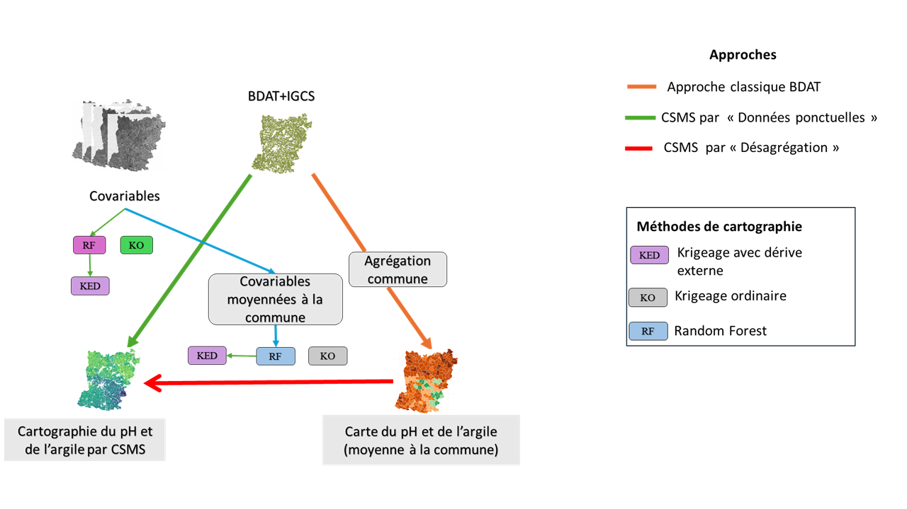

# Quantification de l'apport du géoréférencement précis de données 

Ce repertoire est créeé pour héberger les scripts utilisés dans le cadre d'un mémoire de fin d'études sur le thème portant : Apport de la géolocalisation précise de données fournies par les agriculteurs pour l’analyse spatiale des propriétés des sols à l’échelle d’un département. 
Les données utilisées dans le cadre de ce stage sont celles de la BDAT (Base de Données Analyse de Terres) et celles de l'IGCS (Inventaire Gestion et Conservation des Sols). La BDAT est un programme du Gis Sol (Groupement d'intérêt scientifique sur les sols) qui recueille pour la France métropolitaine les résultats d’analyses de terre effectuées à la demande des agriculteurs auprès de laboratoires d’analyse de terre agréés par le ministère de l’agriculture. Les résultats récupérés sont le plus souvent géolocalisés à la commune d’origine du prélèvement et la restitution des statistiques sur les propriétés des sols se fait à l’échelle du canton ou de la petite région agricole

## Présentation du stage
Le stage...

## Model workflow (R scripts)

Cette partie....

### 1. Préparation des données sols

### 2. Extraction des covariables

### 3. Calibration des modèles et cartographie
L'image suivante montre les des différents scénarios de spatialisation testés

  

### 4. Expérience de dégradation de l'information spatiale
La dégradation consiste à faire évoluer le jeu de calibration de façon progressive en faisant dessous-échantillonnages aléatoires, à ajuster un nouveau modèle à partir de ce jeu de donné dégradé et à calculer les indicateurs de qualité de prédiction.
Elle est implémenté lors de la procédure de validation croisée.
La figure ci-après montre la procédure de validation

  

    

### 5. Expérience de Geomasking

## Réferences

