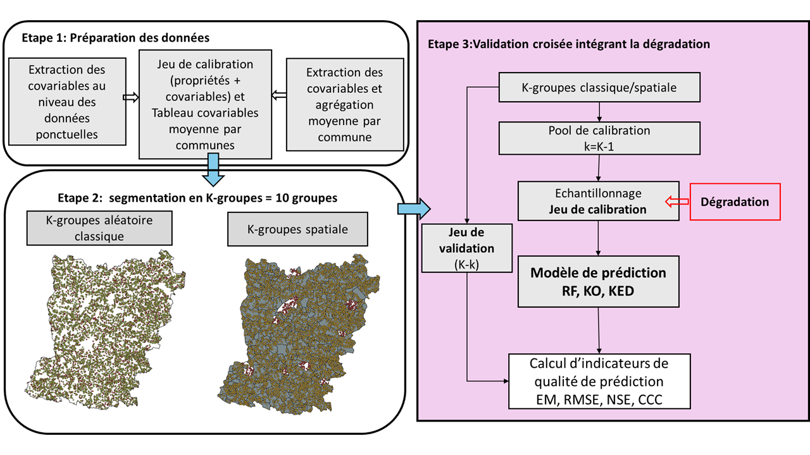

# Quantification de l'apport du géoréférencement précis de données 

Ce repertoire est créeé pour héberger les scripts utilisés dans le cadre d'un mémoire de fin d'études sur le thème portant : Apport de la géolocalisation précise de données fournies par les agriculteurs pour l’analyse spatiale des propriétés des sols à l’échelle d’un département. 
Les données utilisées dans le cadre de ce stage sont celles de la BDAT (Base de Données Analyse de Terres) et celles de l'IGCS (Inventaire Gestion et Conservation des Sols). La BDAT est un programme du Gis Sol (Groupement d'intérêt scientifique sur les sols) qui recueille pour la France métropolitaine les résultats d’analyses de terre effectuées à la demande des agriculteurs auprès de laboratoires d’analyse de terre agréés par le ministère de l’agriculture. Les résultats récupérés sont le plus souvent géolocalisés à la commune d’origine du prélèvement et la restitution des statistiques sur les propriétés des sols se fait à l’échelle du canton ou de la petite région agricole

## Présentation du stage
Le stage vise à quantifier *l'apport du géoréférencement précis des données dans la spatialisation des propriétés des sols comparé à un géoréférencement à la commune comme dans la BDAT*.
En effet , le géoréférecemment comme la restitution des données sur les propriétés des sols de la BDAT est tributaire du support géographique qui n'est pas fixe car les communes peuvent se fusionnées comme se disloquées, ce qui contitue une limite dans l'explotation et la restitution des résultats. Ainsi pour monter l'importance d'avoir des données precises indépendantes du support géographique, ce présent travail se base sur l'hypothèse que les données géoréférencées apportent une précision plus grande que les données agrégées dans la cartographie des propriétés des sols. 
Pour répondre à cette hypothèse, des techniques de cartographie des sols par modélisation statistique (CSMS)sont utilisées dans des scénarios différents. 
Le travail s'articule autour de deux approches de CSMS:
 - La première approche est appelée « Données ponctuelles » où nous utilisons les données ponctuelles comme données d’entrée dans les modèles;
 - La deuxième consiste à agréger à la commune, par la moyenne, les valeurs des propriétés de sol et celles des covariables et de les affecter à leurs centroïdes. Cette méthode nous permet de simuler la BDAT en masquant la localisation de l’information spatiale. Les données ainsi obtenues et qui vont servir d’entrée dans les méthodes statistiques sont des moyennes communales comme dans la diffusion des données de la BDAT. Nous appelons cette méthode « Désagrégation » par le fait que la valeur au support communal est réaffectée au centroïde de la commune.
L'image suivante montre les des différents scénarios de spatialisation testés

  

Dans ces différentes approches, les méthodes utilisées pour la cartographie sont : une régression suivant l’approche SCORPAN avec la forêt aléatoire (Random Forest), une méthode géostatistique (le krigeage) qui se fonde sur les corrélations spatiales et enfin une méthode hybride (le krigeage avec dérive externe) combinant les deux précédentes méthodes. Les méthodes géostatistique et hybride sont implémentées dans un contexte bayésien en utilisant l'approximation de Laplace imbriquée intégrée avec l'approche d'équation aux dérivées partielles stochastiques (INLA SPDE).
Une procédure de validation croisée (classique et spatiale) est également implémenté pour évaluer la capacité de généralisation des modèles prédictifs en calculant des indicateurs de qualité de prédiction comme le NSE(Nash-Sutcliffe Efficiency), l'EM (Erreur moyenne) le REQM(racine carrée de l’erreur quadratique moyenne ), le CCC (Coefficient de concordance).
Au cours de cette procédure de validation croisée, une expérience de dégradation progressive de l'information spatiale est menée pour évaluer la robustesse des modèles face aux variations de la densité d'échantillonnage. Cette expérience consiste à faire évoluer le jeu de calibration de façon progressive en faisant des sous-échantillonnages aléatoires, à ajuster un nouveau modèle à partir de ce jeu de données dégradé et à calculer les indicateurs de qualité de prédiction.
La figure ci-après montre la procédure de validation

  

Les blocs suivant décrivent la chaine de traitementqs fait de l'extraction des données à la visualisation des résultats.

## Model workflow (R scripts)

Cette partie montre l’organisation général de la chaine de traitement depuis la préparation des données jusqu’aux différents tests réalisés (Géo-masquage, Dégradation) en passant par la calibration des modèles et la cartographie des propriétés de sol.

### 1. Préparation des données sols

C’est la première étape du travail et consiste à harmoniser les données pour obtenir une base de données uniforme et propre pour les traitements. Ainsi le script [1_preparation_des_donnees_sol.R]( 1_preparation_des_donnees_sol.R) nettoie et reprojette les coordonnées pour les données de la BDAT, vérifie les codes INSEE et garde les points dans la zone agricole. Pour les données IGCS, le script permet de les harmoniser à une épaisseur de 0–30 cm. En effet les données IGCS sont des profils avec des épaisseurs variables. Selon le type de profil rencontré, différentes méthodes (moyennes pondérées, splines quadratiques à aires égales) sont utilisées pour avoir l’information sur l’horizon 1 d’une épaisseur de 0-30 cm. Les types de profils suivants sont rencontrés : 

  -	Profil avec un horizon unique dont l’épaisseur est supérieure ou égale à 30 cm, (1)
  -	Profil avec deux horizons dont le premier horizon est compris entre 30 et 35 cm, (2)
  -	Profil sur deux horizons dont le premier horizon n’excède pas 30 cm, (3)
  -	Profil de trois horizons dont le premier horizon compris entre 30 et 35 cm, (4)
  -	Profil de trois horizons ou plus dont le premier horizon n’excède pas 30 cm. (5)

Pour les cas de figure (1), (2) et (4), la valeur de la propriété pour le premier horizon est retenue. Pour le cas (3), une moyenne pondérée est effectuée et pour le (5) des splines quadratiques à aires égales égale sont utilisées. Seules les données sur la zone agricole sont retenues et les deux bases sont fusionnées pour former le jeu de données d’entrée pour les modèles

### 2. Extraction des covariables
Les covariables sont nécessaires pour implémenter le modèle de Random Forest dont les prédictions sont également utilisées comme dérive dans le Krigeage avec dérive externe. Ces covariables étant des rasters décrivant des valeurs continues comme catégorielles, le script [2_Extraction_matrice_de_covariables.R]( 2_Extraction_matrice_de_covariables.R) permet ainsi d’extraire en chaque point du jeu de données les valeurs des covariables correspondantes. Il permet également dans l’approche de désagrégation de calculer pour chaque commune, la valeur moyenne des covariables (mode ou moyenne selon la nature de la covariable) qui sont ensuite assignées aux centroïdes.

### 3. Calibration des modèles et cartographie
Quelque soit l’approche utilisée (Données Ponctuelles ou Désagrégation) la façon de calibrer les modèles est la même. La différence réside au niveau des jeux de données d’entrée pour la calibration des modèles. Le script [31_Calibration_RF.R]( 31_Calibration_RF.R) permet de calibrer le modèle de Random Forest. Ce script sélectionne les covariables les plus importantes par Boruta puis calibre un modèle de Random Forest avec tuning des hyperparamètres et fait une validation croisée. Les scripts [32_Calibration_KO.R]( 32_Calibration_KO.R) et [33_Calibration_KED.R]( 33_Calibration_KED.R) permettent de calibrer respectivement les modèles de Krigeage Ordinaire et de Krigeage avec dérive externe dans un cadre Bayésien avec INLA SPDE (Approximation de Laplace imbriquée intégrée avec l'approche d'équation aux dérivées partielles stochastiques).

Ainsi pour la calibration des modèles, un champ spatial est modélisé grâce à SPDE et la création de ce champ passe par un maillage pour discrétiser le champ spatial et une définition des a priori. Ensuite les modèles sont définis puis ajustés à l’aide de inlabru et la prédiction peut enfin se faire sur une grille préalablement définie. Les modèles sont également évalués par une procédure de validation croisée.Ces scripts sont secondaires et sont à charger dans le script principal [3_Script_principal_cartographie.R]( 3_Script_principal_cartographie.R).

### 4. Test de la dégradation de l'information spatiale

Ce test consiste à diminuer de façon progressive la taille du jeu de données de calibration, à calibrer les modèles avec ce jeu de données réduit afin d’évaluer l’influence de la densité d’échantillonnage sur la qualité des prédictions et la sensibilité des modèles utilisées face à une diminution de la densité d’échantillonnage du jeu de calibration. En d’autres termes, cela permet de savoir à quel point la quantité de données disponibles pour la calibration affecte les performances des modèles. Ce test est implémenter lors de la procédure de validation croisée [4_Script_CV_degradation.R]( 4_Script_CV_degradation.R). Pour chaque taille d’échantillon du jeu de calibration et pour 30 répétitions, nous procédons ainsi : nous définissons d’abord 10 groupes pour les validations croisées spatiale et classique. Ensuite pour chaque itération, le jeu de calibration est échantillonné sur les k-1 groupes et la prédiction se fait sur le groupe restant. Enfin les indicateurs de qualité de prédiction sont calculés puis moyennés par taille d’échantillon et par type de validation croisée. Les scripts [41_fonction_RF.R]( 41_fonction_RF.R) et [42_fonction_KO_KED.R]( 42_fonction_KO_KED.R) permettent de calibrer les modèles lors de la validation croisée, d’automatiser le processus selon l’approche et le type de validation croisée. Le script [43_Graphique_degradation.R]( 43_Graphique_degradation.R) permet de visualiser le résultat du test de dégradation.

### 5. Expérience de Geomasking

## Réferences

